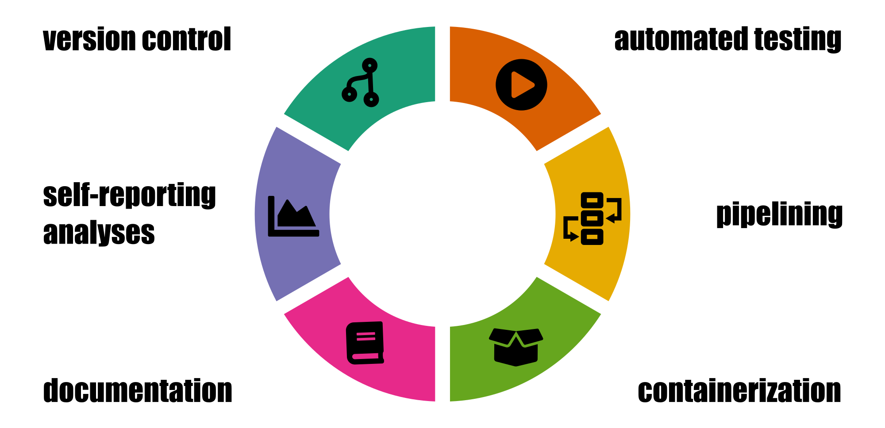

# Hallmarks of Good Scientific Software

read the post at https://grst.github.io/bioinformatics/2020/07/16/hallmarks-scientific-software.html. 

All icons except the pipeline icon are from `fontawesome` under CC-BY-4.0.
I made the pipeline icon myself from scratch. 

The graphics in this repo may be reused under CC-BY 4.0.
